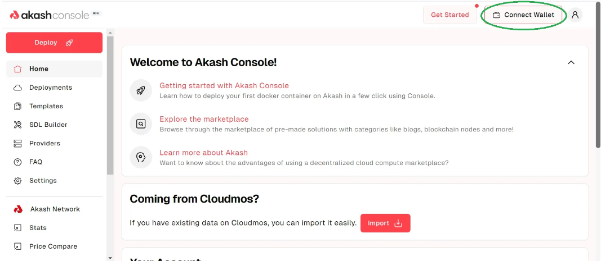
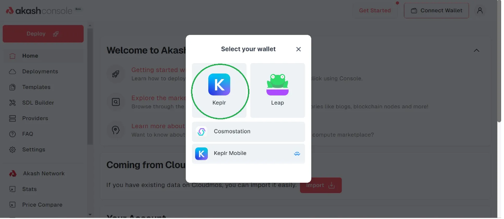
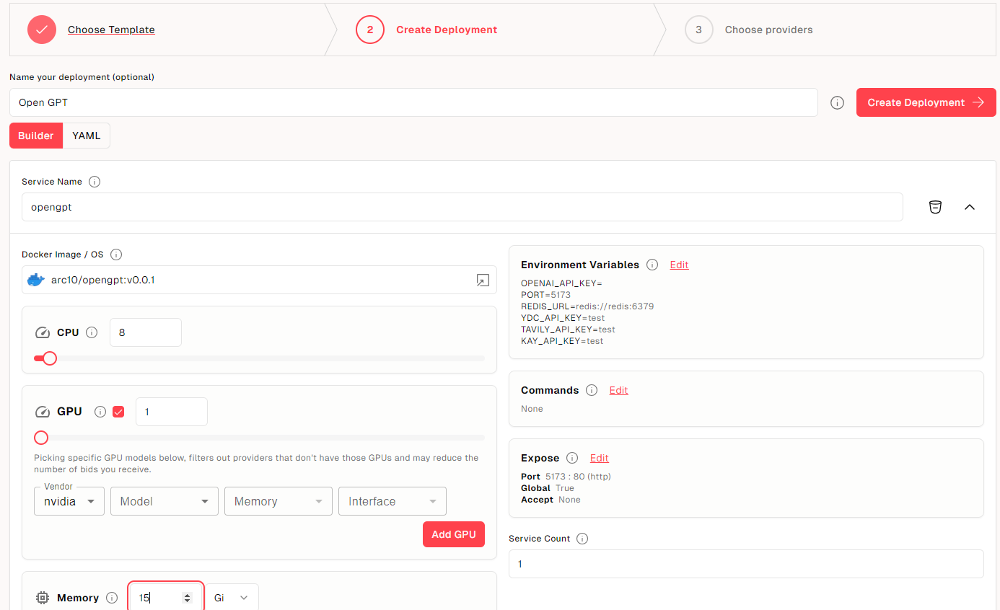
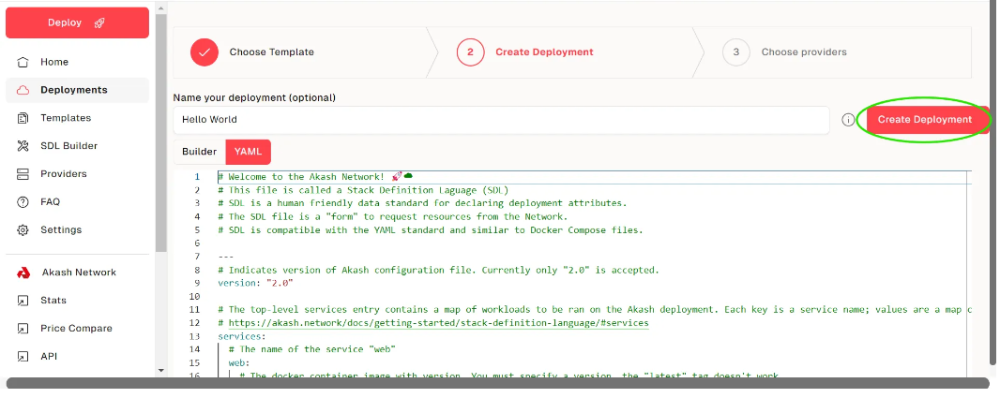
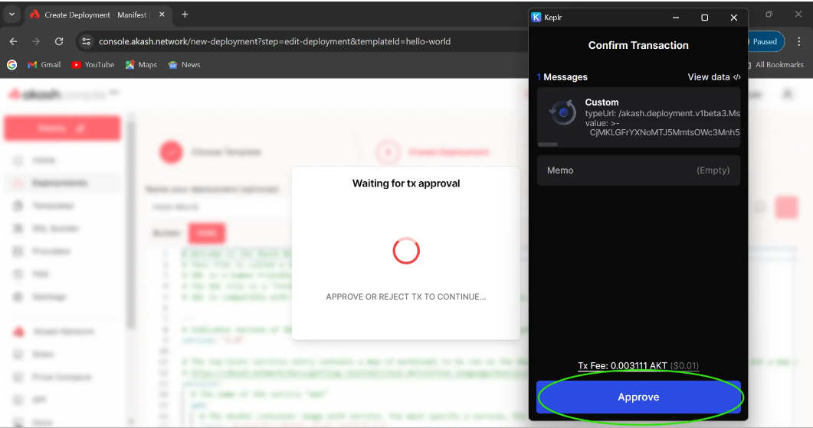
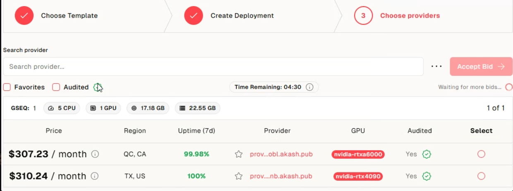

## Deploy Agent AI to Akash

This guide will walk you through deploying Agent AI application onto the Akash Network via The Akash CLI. 

### Before Getting Started
You must have Akash CLI installed and properly configured along with some AKTs in your wallet(0.5 AKT minimum for a single deployment plus a small amount for transaction fees).

Follow <a href="https://akash.network/docs/deployments/akash-cli/installation/#install-akash-cli">CLI Installation Guide</a> to install the Akash CLI if necessary.

to buy or bridge AKT token, you can use this <a href="https://www.rocketx.exchange/">DEX</a>.

## 1. Using Akash CLI
### Check your Account Balance
Check your account has sufficient balance by running:

```plaintext
provider-services query bank balances --node $AKASH_NODE $AKASH_ACCOUNT_ADDRESS
```
You should see a response similar to:

```yaml
balances:
- amount: "93000637"
  denom: uakt
pagination:
  next_key: null
  total: "0"
```
### STEP 1:- Build Docker Image
At first, have to build docker image for Akash Deploying.
Akash is using Docker image, so you must prepare Docker image.

we can make image from below command.
 ```bash
 docker build -t YOUR_NAME/communeai:latest .
 ```

 then we have to replace this image in `deploy.yaml`.
 ```yaml
 ---
version: "2.0"
services:
  service-1:
    image: YOUR_NAME/communeai
    expose:
      - port: 80
        as: 80
        to:
          - global: true
profiles:
  compute:
    service-1:
      resources:
        cpu:
          units: 0.1
        memory:
          size: 512Mi
        storage:
          - size: 1Gi
  placement:
    dcloud:
      pricing:
        service-1:
          denom: uakt
          amount: 10000
deployment:
  service-1:
    dcloud:
      profile: service-1
      count: 1
```

### STEP 2: -View your Bids and choose a provider
After a short time, you should see bids from providers for this deployment with the following command:

```bash
provider-services query market bid list --owner=$AKASH_ACCOUNT_ADDRESS --node $AKASH_NODE --dseq $AKASH_DSEQ --state=open
```

#### Choose a Provider
Note that there are bids from multiple different providers. In this case, both providers happen to be willing to accept a price of 1 uAKT. This means that the lease can be created using 1 uAKT or 0.000001 AKT per block to execute the container. You should see a response similar to:

```yaml
bids:
- bid:
    bid_id:
      dseq: "140324"
      gseq: 1
      oseq: 1
      owner: akash1vn06ycjjnvsvl639fet9lajjctuturrtx7fvuj
      provider: akash10cl5rm0cqnpj45knzakpa4cnvn5amzwp4lhcal
    created_at: "140326"
    price:
      amount: "1"
      denom: uakt
    state: open
  escrow_account:
    balance:
      amount: "50000000"
      denom: uakt
    id:
      scope: bid
      xid: akash1vn06ycjjnvsvl639fet9lajjctuturrtx7fvuj/140324/1/1/akash10cl5rm0cqnpj45knzakpa4cnvn5amzwp4lhcal
    owner: akash10cl5rm0cqnpj45knzakpa4cnvn5amzwp4lhcal
    settled_at: "140326"
    state: open
    transferred:
      amount: "0"
      denom: uakt
- bid:
    bid_id:
      dseq: "140324"
      gseq: 1
      oseq: 1
      owner: akash1vn06ycjjnvsvl639fet9lajjctuturrtx7fvuj
      provider: akash1f6gmtjpx4r8qda9nxjwq26fp5mcjyqmaq5m6j7
    created_at: "140326"
    price:
      amount: "1"
      denom: uakt
    state: open
  escrow_account:
    balance:
      amount: "50000000"
      denom: uakt
    id:
      scope: bid
      xid: akash1vn06ycjjnvsvl639fet9lajjctuturrtx7fvuj/140324/1/1/akash1f6gmtjpx4r8qda9nxjwq26fp5mcjyqmaq5m6j7
    owner: akash1f6gmtjpx4r8qda9nxjwq26fp5mcjyqmaq5m6j7
    settled_at: "140326"
    state: open
    transferred:
      amount: "0"
      denom: uakt
```
### STEP 3:- Create and confirm a Lease
Create a lease for the bid from the chosen provider above by running this command:
```bash
provider-services tx market lease create --dseq $AKASH_DSEQ --provider $AKASH_PROVIDER --from $AKASH_KEY_NAME
```
#### Confirm the Lease
You can check the status of your lease by running:
```bash
provider-services query market lease list --owner $AKASH_ACCOUNT_ADDRESS --node $AKASH_NODE --dseq $AKASH_DSEQ
```
#### Confirm the URL
Now that the manifest is uploaded, your image is deployed. You can retrieve the access details by running the following command:

```bash
provider-services lease-status --dseq $AKASH_DSEQ --from $AKASH_KEY_NAME --provider $AKASH_PROVIDER
```
You should see a response similar to:
```yaml
{
  "services": {
    "web": {
      "name": "web",
      "available": 1,
      "total": 1,
      "uris": [
        "rga3h05jetf9h3p6dbk62m19ck.ingress.ewr1p0.mainnet.akashian.io"
      ],
      "observed_generation": 1,
      "replicas": 1,
      "updated_replicas": 1,
      "ready_replicas": 1,
      "available_replicas": 1
    }
  },
  "forwarded_ports": {}
}
```
You can access the application by visiting the hostnames mapped to your deployment. Look for a URL/URI and copy it to your web browser.

## 2. Using Akash Console
### Before Getting Started
Console is compatible with two wallets as of now, Keplr and Leap wallet. The Keplr or Leap browser extensions must be installed and with sufficient funds (0.5 AKT minimum for a single deployment plus a small amount for transaction fees).

Follow Keplr Wallet or Leap Cosmos Wallet guides to create your first wallet if necessary.
###Akash Console Access
The Akash Console web app is available via the following URL:

https://console.akash.network/

### STEP 1 - Connect your Keplr or Leap wallet

After clicking connect wallet, you will see an option to choose either Keplr or Leap. Choose your desired option:


### STEP 2 - Load Docker Images and Complete Deploy Configuration

based your project requirement. you can select device options like GPU, CPU, RAM, Strorage.

### STEP 3 - Proceed to pay the deployment deposit
Click the continue button and approve the transaction:

Now approve the transaction:


### STEP 4 - Select the best bid
Now you will see a list of providers with prices. Select whichever you want, preferably the lowest one, and click the Accept Bid button:


### STEP 5 - Confirm the deployment
Now the only thing left to do is to confirm that the deployment was successful. Click the Leases section:

Now visit the URI link:

You will be able to see the website you just deployed:

### License
This project is licensed under the MIT License.
